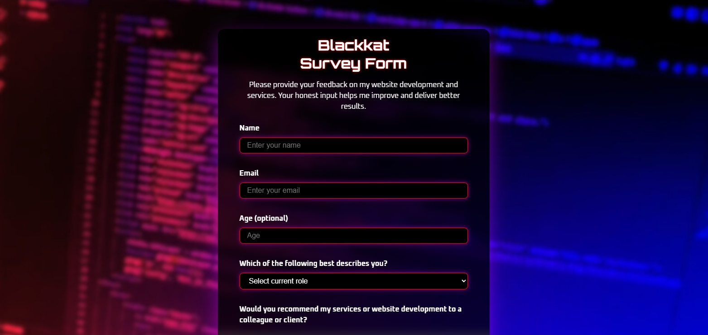

# 📝 Blackkat Survey Form

## 📖 Overview
This survey form was created as part of my Responsive Web Design certification through FreeCodeCamp. The objective of this project was to build a fully responsive survey form using only HTML and CSS. The form is designed to collect user feedback regarding website development and services, with a focus on modern design, clean structure, accessibility, and responsive layout that works seamlessly accross devices.

This project is currently a front-end demo. While the form includes validation and a confirmation popup after submission, it is not connected to a backend or database. Future improvements may include form submission handling and expanded functionality.

## ✨ Features
- Responsive design that adapts to desktop and mobile screens.
- Input fields with validation (name, email, age).
- Dropdown menu for selecting role (Client, Employer, Developer, Other).
- Radio buttons for recommendations.
- Checkboxes for selecting favorite website features.
- Comments textarea with character limit.
- Futuristic UI design with Orbitron and Oxanium fonts.
- Blurred, darkened background effect for readability.

## 🛠️ Built With
- HTML – structure 
- CSS – styling 

## 🚀 How to Use
[`View Live Project`](https://blackkat-dev.github.io/blackkat-survey-form/)

1. Fill in the required fields (Name, Email, Age).
2. Select your role from the dropdown.
2. Select options from radio buttons and checkboxes.
3. Add comments or suggestions (optional).
4. Submit to see the demo popup (form is not connected to a backend).

## 📂 Project Structure
blackkat-survey-form/ `root folder`

│── index.html `main webpage`

│── css/ `styling folder`

│   └── styles.css `styling`

│── img/ `image folder`

│ └── website-favicon.svg `favicon`

│ └── website-preview.jpeg preview `image`

│   └── coding-background.png `background image`

│── LICENSE `license details`

│── README.md `project details`

## 📌 Learning Goals
- Practice semantic HTML form structure.
- Learn to style inputs, dropdowns, radio buttons, and checkboxes with CSS.
- Apply responsive design techniques with media queries.
- Experiment with background blur effects and custom fonts.

## 🎯 Certification Compliance
This project fully meets all FreeCodeCamp Responsive Web Design
Survey Form user stories and requirements.

## 📸 Preview

[`View Live Project`](https://blackkat-dev.github.io/blackkat-survey-form/)

## 📄 License 
This project is provided for portfolio and educational review only. 
Copying, redistribution, or commercial use is prohibited. 

This project is licensed under a Blackkat Proprietary License. 
See the [LICENSE](https://github.com/blackkat-dev/blackkat-survey-form/blob/main/LICENSE) file for full terms.